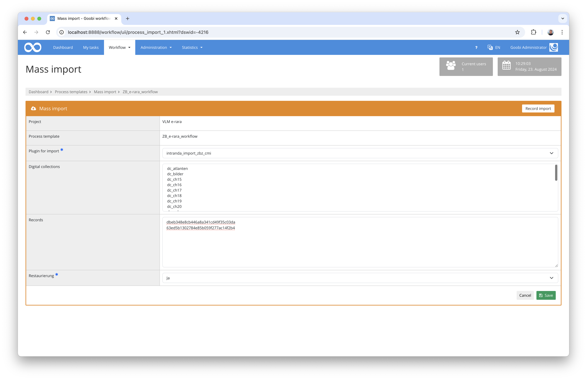

## Introduction
This import plugin allows you to import data with an CMI catalogue query. Data that was previously copied from an Excel file is inserted into the user interface.

## Installation
To be able to use the plugin, the following files must be installed:

```bash
/opt/digiverso/goobi/plugins/import/plugin-import-zbz-cmi-base.jar
/opt/digiverso/goobi/config/plugin_intranda_import_zbz_cmi.xml
```

Once the plugin has been installed, it can be accessed from the overview of production templates by using the second blue button next to the selected production template.


Once the plugin has been entered, a user interface is available in which the data to be imported can be selected or uploaded.




## Overview and functionality
After selecting the correct plugin, the data, which is either available as TAB-separated CSV data or copied from an Excel file, can be inserted into the `Records` field in the user interface. The data has the following structure:

Column    | Metadata        | Explanation
----------|-----------------|-------------------------
`1`       | `CMI-ID`        | If this contains an underscore, a multi-volume work is created, otherwise a monograph. This is a mandatory entry.

Immediately after inserting the data and clicking on `Save`, the creation of the processes starts without a catalogue being requested.


## Configuration
The plugin is configured in the file `plugin_intranda_import_zbz_cmi.xml` as shown here:

{{CONFIG_CONTENT}}

The following table contains a summary of the parameters and their descriptions:

Parameter               | Explanation
------------------------|------------------------------------
`template`              | This can be used to define which production template the respective `config` block should apply to. 
`runAsGoobiScript`      | This parameter can be used to specify whether the import should take place as GoobiScript in the background.
`catalogue`             | The catalogue to be used for the query is defined here. This must be defined within the configuration file `goobi_opac.xml`.
`searchField`           | This parameter defines in which field of the catalogue the search for the identifier should take place.